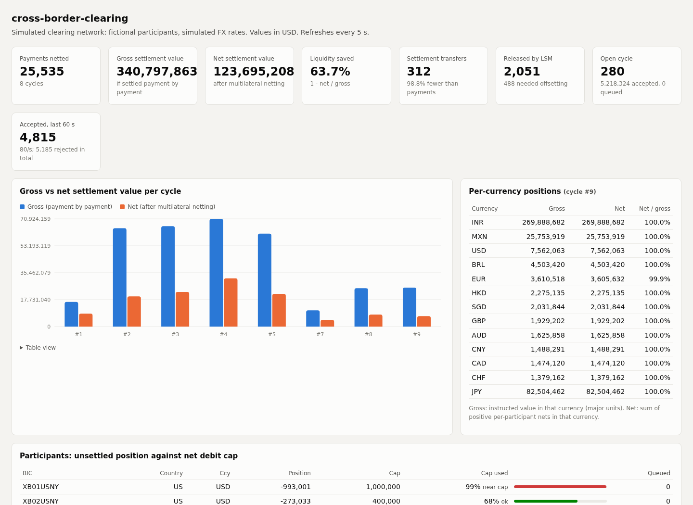
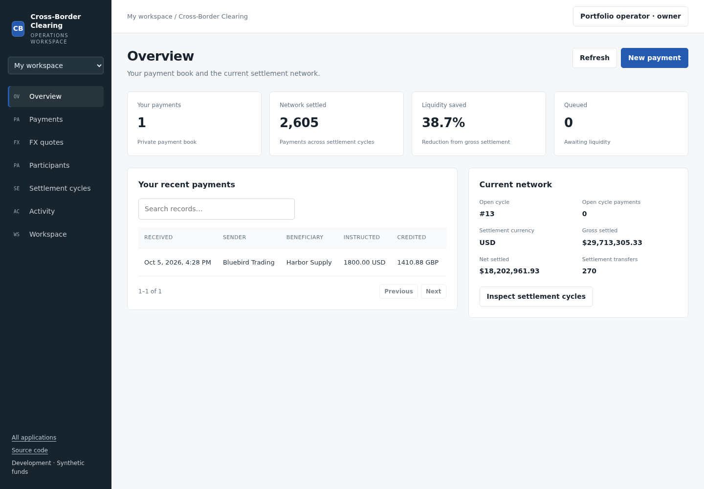
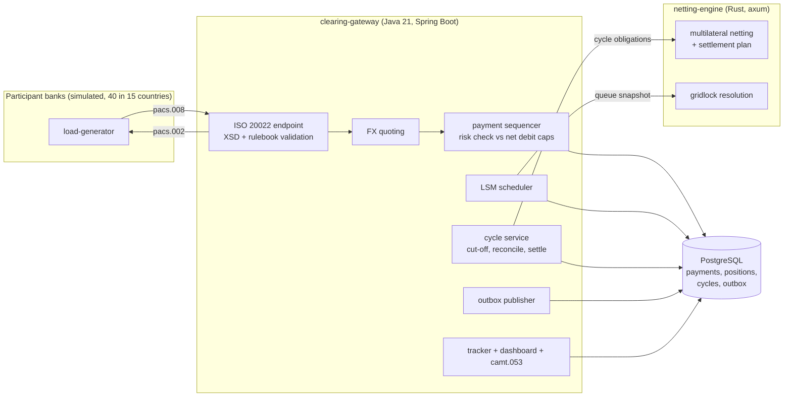

# cross-border-clearing

**[Open the application](https://leads.realalma.com/fintech/cross-border-clearing/)** · Submit cross-border ISO 20022 payments; track each status change; request FX quotes; manage liquidity queues; close settlement cycles; and download participant statements.

A cross-border instant payment clearing and multilateral netting network,
built as a working simulation: an ISO 20022 gateway in Java (Spring Boot,
PostgreSQL) and a netting and liquidity-saving engine in Rust.

It is inspired by how real infrastructures work - SWIFT gpi-style payment
tracking, the ISO 20022 migration of high-value payment systems, CLS-style
multilateral netting of obligations, and the liquidity-saving mechanisms of
RTGS systems - but it is a personal portfolio project: **all participants,
BICs, accounts and FX rates are fictional or simulated, and it is not
connected to any real network.**



[Local clearing exercise recording](docs/demo.webm)

## Use the application

Create an account, sign in, or open a private workspace and save your account later. One account works across all four applications. Workspaces have persistent records, searchable tables, activity logs, and team invitations. Your saved data is retained when you reload or sign in from another device.

Payment instructions are private to your workspace. The clearing network, participant positions, and aggregate settlement cycles are shared between operators.

All funds, cards, institutions, and sample transactions are synthetic. The applications do not connect to real banking or card networks.

[Application workflows and hosting details](docs/application.md)



## The problem

A cross-border payment today usually travels through a chain of correspondent
banks. Each hop adds fees, a cut-off time and a reconciliation step; each bank
must pre-fund nostro accounts in foreign currencies; and settling every
payment gross ties up a lot of liquidity. A clearing network changes the
shape of the problem:

* banks send ISO 20022 messages to one hub instead of along a chain;
* the hub checks each payment against the sending bank's prefunded or
  collateralised limit, so the beneficiary can be credited immediately with
  guaranteed settlement;
* at the end of a clearing cycle all obligations are **netted
  multilaterally**, so banks settle a handful of net amounts instead of every
  payment;
* payments that would break a limit are queued, and a **liquidity-saving
  mechanism** releases sets of queued payments that offset each other.

This repository implements that flow end to end and measures it.

## Architecture



| Component | What it does |
|---|---|
| `iso20022-model` | JAXB classes generated from the **official ISO 20022 XSDs** (pacs.008.001.08, pacs.002.001.10, camt.053.001.08, downloaded from iso20022.org), plus a pacs.008 writer and fictional-account generators for tests and simulation. |
| `clearing-gateway` | Accepts pacs.008 over HTTP, validates (schema, BIC, IBAN, CLABE, currency decimals, duplicate MsgId / EndToEndId / UETR), quotes FX, runs the pre-settlement risk check, answers with pacs.002, tracks every state transition, runs clearing cycles, produces camt.053 statements, publishes events through a transactional outbox, serves the dashboard. |
| `netting-engine` | Stateless Rust service: multilateral netting with three FX modes, a settlement-transfer planner (exact for up to 20 non-zero positions), and FIFO-preserving gridlock resolution. Property-tested and benchmarked. |
| `load-generator` | Synthetic traffic over a skewed corridor model (US-MX, US-IN, EU-GB, GB-IN, SG-IN, HK-CN, US-CA, EU-CH, JP-US, AU-SG, ...) with a retail / SME / corporate size mixture; measures throughput and latency and collects cycle results. |

### Message flow

```mermaid
sequenceDiagram
    participant D as Debtor agent
    participant G as Gateway
    participant S as Sequencer (single writer)
    participant P as PostgreSQL
    participant E as Netting engine
    participant C as Creditor agent
    D->>G: pacs.008 (UETR, EndToEndId, amount in own currency)
    G->>G: XSD validation, rulebook checks, FX quote
    G->>S: prepared payment
    S->>P: one transaction per batch: claim UETR + EndToEndId,<br/>lock positions, check caps in arrival order,<br/>write states, history, outbox
    S-->>G: ACCEPTED / QUEUED / REJECTED
    G-->>D: pacs.002 (ACSP / PDNG / RJCT + reason code)
    P-->>C: outbox: PaymentAccepted (credit beneficiary now)
    Note over G,E: every 500 ms: queue snapshot -> gridlock resolution -> release offsetting set
    Note over G,E: cycle cut-off
    G->>E: cycle obligations
    E-->>G: net positions + settlement transfers
    G->>G: reconcile independently (nets, zero sum, transfers)
    G->>P: CLEARED, settlement instructions; then SETTLED, positions released
    G-->>D: tracker shows ACSC, camt.053 statement available
```

Payment states: `RECEIVED -> VALIDATED -> FX_QUOTED -> (QUEUED ->) ACCEPTED -> CLEARED -> SETTLED`,
or `REJECTED` from any pre-acceptance state. The tracker
`GET /payments/{uetr}/status` returns the current status and the full
timestamped history.

## Measured results

Measured on 2026-10-05 on a shared 8-vCPU Broadwell-class VPS. The Java gateway,
PostgreSQL 14, Rust engine and generator run on the same host. Results include
concurrent JVM/compiler and other workloads; they are development measurements.

**End-to-end run:** 20,000 synthetic payments, 40 participants, 32 in-flight
HTTP requests, up to 16 transfers per ISO message, four manually closed cycles,
and 1,000 warm-up payments excluded from the measured cycles.

| Measurement | Result |
|---|---:|
| Submission throughput (validation, FX, risk check, durable commit) | 1,665 payments/s |
| HTTP message p50 / p99 latency | 267 / 580 ms |
| HTTP errors | 0 |
| Payments netted | 20,000 |
| Gross / net settlement | $262,986,416.97 / $95,933,017.54 |
| Settlement liquidity reduction | 63.52% |
| Settlement transfers | 156, down 99.22% from 20,000 gross transfers |

Latency is per HTTP message carrying up to 16 payments, not per individual
payment. 67 payments initially received `PDNG`; all were released and the queue
was empty at the end. Liquidity reduction depends on the synthetic traffic mix.

**Liquidity stress:** with participant caps reduced to 5%, a separate 10,000-payment
run released 1,704 queued payments, **422 through offsetting**, and netted 4,535.
It also returned 4,645 `RJCT` statuses and left 820 queued payments at the observation
cutoff. This is a constrained-liquidity scenario, not a successful settlement of
every submitted payment; the background jobs continue after the snapshot.

**Rust kernel only:** Criterion mean times were 18.20 ms for 100,000 obligations
and 178.30 ms for 1,000,000 (about 5.5 million obligations/s), with precomputed FX
and 40 participants. These figures exclude JSON decoding, HTTP and PostgreSQL.

Raw reports: [gateway run](results/gateway-2026-10-05.json),
[liquidity stress](results/liquidity-stress-2026-10-05.json),
[Criterion estimates](results/engine-2026-10-05.json), and
[machine context](results/machine.json). The first gateway report's `startedAt`
field was captured at report completion; the generator now records start and
completion separately.

```bash
java -jar load-generator/target/load-generator-0.1.0-SNAPSHOT.jar \
  --url=http://localhost:8080 --payments=20000 --concurrency=32 \
  --batch=16 --cycles=4 --warmup=1000 --out=results/run.json
java -jar load-generator/target/load-generator-0.1.0-SNAPSHOT.jar \
  --url=http://localhost:8080 --payments=10000 --concurrency=32 \
  --batch=16 --cycles=4 --warmup=0 --cap-scale=0.05 --out=results/stress.json
(cd netting-engine && cargo bench --bench netting -- netting_precomputed_40p/100000 --noplot)
```

## How to run

### Whole stack with Docker Compose

```bash
docker compose up --build            # postgres + netting engine + gateway
open http://localhost:8080/          # dashboard
docker compose --profile load run --rm loadgen --payments=20000 --cycles=4
```

The gateway cuts off a cycle every 60 s (`CYCLE_INTERVAL`), runs the LSM
every 500 ms and publishes outbox events every 200 ms.

### Locally

Requirements: JDK 21, Rust (stable), Docker (for PostgreSQL and
Testcontainers). Maven is provided by the wrapper (`./mvnw`, Maven 3.9.11).

```bash
# 1. PostgreSQL
docker run -d --name xbc-pg -e POSTGRES_USER=clearing -e POSTGRES_PASSWORD=clearing \
  -e POSTGRES_DB=clearing -p 5432:5432 postgres:16-alpine

# 2. Netting engine
(cd netting-engine && cargo run --release)          # listens on :7070

# 3. Gateway (+ load generator jar)
./mvnw -B package -DskipTests
java -jar clearing-gateway/target/clearing-gateway-0.1.0-SNAPSHOT.jar   # :8080, dashboard at /

# 4. Traffic
java -jar load-generator/target/load-generator-0.1.0-SNAPSHOT.jar \
  --url=http://localhost:8080 --payments=100000 --concurrency=128 --cycles=5 --out=results/run.json
```

Useful endpoints:

| Endpoint | Purpose |
|---|---|
| `POST /iso20022/pacs.008` | submit a pacs.008.001.08, receive pacs.002.001.10 |
| `GET /payments/{uetr}/status` | tracker: status and history |
| `GET /api/fx/rates`, `POST /api/fx/quotes` | simulated rates, indicative quote |
| `POST /api/admin/cycles/close` | cut off, net and settle now |
| `GET /api/cycles`, `/api/cycles/{id}/positions`, `/transfers` | cycle results |
| `GET /api/cycles/{id}/statements/{bic}` | camt.053.001.08 statement |
| `GET /api/participants/{bic}/notifications` | simulated participant inbox (outbox sink) |
| `PUT /api/admin/participants/{bic}/cap` | change a net debit cap |
| `GET /actuator/prometheus` | metrics |

### Tests

```bash
(cd netting-engine && cargo fmt --check && cargo clippy --all-targets -- -D warnings && cargo test)
./mvnw -B verify                      # unit + integration tests (Testcontainers PostgreSQL)
ENGINE_URL=http://localhost:7070 ./mvnw -B verify   # also runs the Rust/Java contract test
(cd netting-engine && cargo bench)    # criterion benchmarks
```

`TEST_DB_URL` can point the integration tests at an existing PostgreSQL
instead of Testcontainers.

**35 Rust tests and 72 Java tests passed, with no skips.** The Java run used an
isolated PostgreSQL instance and the real Rust service for both contract tests.
Coverage includes ISO schema round trips, validation and idempotency, concurrent
risk checks, cycle reconciliation, engine failures, FX expiry, outbox replay,
FIFO gridlock release, settlement conservation, and property-tested netting.
Both the cycle chart and participant table also passed a recorded browser check
with no page errors or failed network requests.

## Design

[docs/design.md](docs/design.md) explains the decisions: ISO 20022 versions
and status semantics, the three levels of idempotency, why payments go
through a single-writer batching sequencer, the netting algorithm and its
complexity, the gridlock-resolution algorithm with its correctness argument,
failure handling between Java and Rust, the outbox, and the locking order.

## Limitations

* Simulation only: fictional participants (`XB01`..`XB40` BIC prefixes), synthetic
  accounts, simulated FX rates and a simulated settlement agent that confirms
  settlement immediately. Not connected to any real network, bank or central bank.
* Account validation uses simplified national formats (IBAN, CLABE, digit-length rules).
* Admin endpoints are unauthenticated; no mTLS, message signing or sanctions screening.
* Single gateway instance: the sequencer and cycle jobs assume one writer
  (multi-instance would need leader election).
* Settlement is one settlement-currency (USD) leg per participant; no
  payment-versus-payment settlement of the FX legs.
* Benchmarks ran on a shared virtual machine; treat absolute numbers as
  indicative and the relative ones (netting savings, scaling) as the point.

## License

MIT - see [LICENSE](LICENSE).
